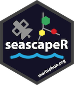

<!-- README.md is generated from README.Rmd. Please edit that file -->
<!-- DELETE data_ss/ before running -->

```{r, include = FALSE}
#' TODO: unit tests with workflows
#'   - get_url_ply() -> ply -> ss_grds -> ss_ts; check pixels with reference
#'   - bbox_to_ply() -> ply -> ss_grds -> ss_viz -> map; check pixels with reference

knitr::opts_chunk$set(
  collapse = TRUE,
  comment = "#>",
  fig.path = "man/figures/"
)
# devtools::install_local(force = T)
# devtools::load_all()
```

# seascapeR 

<!--
[](https://github.com/marinebon/seascapeR/actions?query=workflow%3Apkgdown)
-->

<!--
[](https://github.com/mitchelloharawild/icon/actions?workflow=R-CMD-check)
[](https://codecov.io/gh/mitchelloharawild/icon?branch=master)
[](https://www.tidyverse.org/lifecycle/#experimental)
[](https://cran.r-project.org/package=icon)
-->
<!-- [](https://cran.r-project.org/package=icon) -->


The `seascapeR` package provides functions for fetching, analyzing and visualizing [ Seascapes](https://coastwatch.noaa.gov/cw/satellite-data-products/multi-parameter-models/seascape-pelagic-habitat-classification.html), a global and regional dynamic sea water classification product derived from satellite imagery by [Maria Kavanaugh (OSU)](https://ceoas.oregonstate.edu/people/maria-kavanaugh). 

In particular, this package is meant to help nodes in the [MarineBON.org](https://marinebon.org) network extract Seascape data, especially across [NOAA Sanctuaries](https://sanctuaries.noaa.gov), for comparison with biological data from eDNA, sound, telemetry and other observational data to evaluate how dynamic water masses relate to ecosystem function.

## Shiny app

Besides the documentation below and in [Get Started](https://marinebon.org/seascapeR/articles/seascapeR.html), to see an example of how `seascapeR` functions get used to fetch data across sanctuaries, check out the [get_data.R](https://github.com/marinebon/seascape_app/blob/main/get_data.R) script. The gathered data from this script then feeds the [Seascapes for Sanctuaries app](https://shiny.marinebon.app/seascapes/) built with [Shiny](https://shiny.rstudio.com). To see how the app generates maps and time series plots, see the app's code at [app.R](https://github.com/marinebon/seascape_app/blob/main/app/app.R). To see how the Seascape definitions with accompanying relative histograms are rendered in  [classes.html](https://shiny.marinebon.app/seascapes/classes.html) see the source [Rmarkdown](https://rmarkdown.rstudio.com) file [classes.Rmd](https://github.com/marinebon/seascape_app/blob/main/app/www/classes.Rmd).

<!-- [multi-column layout](https://bookdown.org/yihui/rmarkdown-cookbook/multi-column.html] -->
:::: {style="display: flex;"}

::: {}

[Seascapes for Sanctuaries](https://shiny.marinebon.app/seascapes/) Shiny app:


:::

::: {}

[Seascape Classes](https://shiny.marinebon.app/seascapes/classes.html) described:


:::

::::

## Install

```r
remotes::install_github("marinebon/seascapeR")
```

## Use

Load the library and map Seascape classes using a web map server (wms) that loads image tiles (not data) interactively (zoom, pan) from R.

```{r README-map_seascape_wms}
library(seascapeR)

# variables
sanctuary   = "mbnms"          # or see: ?get_url_ply
ss_dataset  = "global_monthly" # or "global_8day"
ss_var      = "CLASS"          # or "P"
date_beg    = "2020-01-01"
date_end    = "2021-01-01"

# paths
dir_data = here::here("data_ss")
dir_ply  = glue::glue("{dir_data}/ply")
dir_grd  = glue::glue(
  "{dir_data}/{sanctuary}_{ss_dataset}")
ts_csv   = glue::glue(
  "{dir_data}/{sanctuary}_{ss_dataset}_{ss_var}.csv")

# get sanctuary polygon
ply <- get_url_ply(
  sanctuary = sanctuary, 
  dir_ply   = dir_ply)
ply

# get SeaScape dataset information
ss_info <- get_ss_info(dataset = ss_dataset)
ss_info

# map SeaScape using web map server (wms) image tiles
map_ss_wms(ss_info, ply, ss_var = ss_var)

# get SeaScape grids within polyon for date range 
grds <- get_ss_grds(
  ss_info, ply, 
  ss_var    = ss_var, 
  date_beg  = date_beg, 
  date_end  = date_end,
  dir_tif   = dir_grd)

# get first grid, a raster layer in the raster stack grds
grd <- raster::raster(grds, 1)

# map SeaScape grid
map_ss_grd(grd)

# summarize SeaScape grids into a time series table
tbl <- sum_ss_grds_to_ts(grds, ts_csv = ts_csv)
tbl

# plot SeaScape time series
plot_ss_ts(tbl, show_legend = "always")
```

### Interactivity

Note that when you run the code above in any of these R environments, you get an interactive visualization:

1. [RStudio](https://rstudio.com/products/rstudio/download/) Console;
1. knitted html from an [Rmarkdown](https://rmarkdown.rstudio.com/) document; or 
1. a [Shiny](https://shiny.rstudio.com/) app.

The interactive map allows you to zoom and pan. The time series has sliders to change the time window and hover over to get values.

For more on how to use the `seascapeR` functions and view these interactive visualizations, see the [Getting Started](articles/seascapeR.html) article.

### Data files

Data files were cached by setting path variables and feeding as arguments to functions in the following order:

1. `get_url_ply()`: Based on `dir_ply`, save \*.zip, unzip and shapefile with file components \*.shp, etc, readable by any GIS program. 
1. `get_ss_grds()`: Based on `dir_grd`, save grids (aka rasters) as GeoTIFs (*.tif) with filenames of form "grd\_\[ss\_var\]\_\[date\].tif", readable by any GIS program.
1. `plot_ss_ts()`: Based on `ts_csv`, save the table as a comma-seperated value (*.csv) file, readable by any spreadsheet program.

```{r}
fs::dir_tree(dir_data)
```


## Contribute

For more on how to contribute to `seascapeR` package development, see [CONTRIBUTE.md]( https://github.com/marinebon/seascapeR/blob/main/CONTRIBUTE.md).


