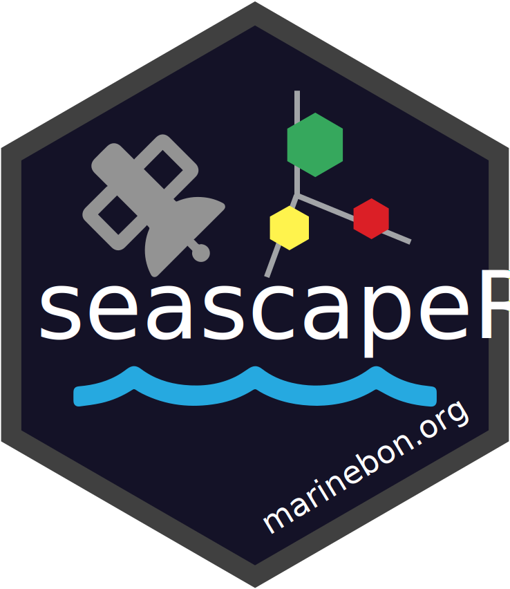
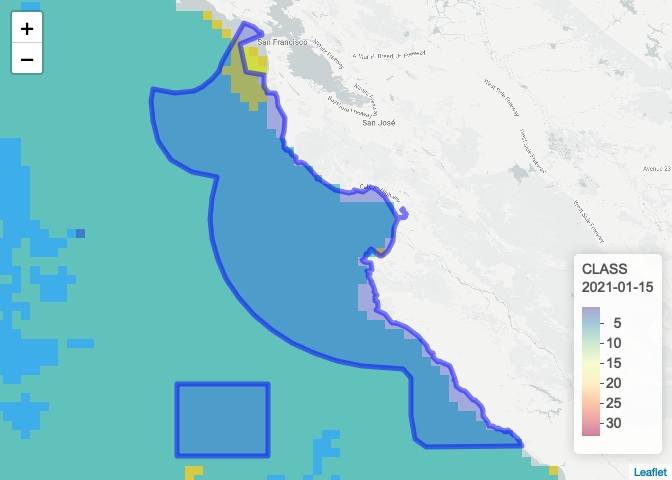

<!-- README.md is generated from README.Rmd. Please edit that file -->

<!-- README.md is generated from README.Rmd. Please edit that file -->

# seascapeR <a href='https://marinebon.org/seascapeR'></a>

[](https://github.com/marinebon/seascapeR/actions?query=workflow%3Apkgdown)

<!--
[](https://github.com/mitchelloharawild/icon/actions?workflow=R-CMD-check)
[](https://codecov.io/gh/mitchelloharawild/icon?branch=master)
[](https://www.tidyverse.org/lifecycle/#experimental)
[](https://cran.r-project.org/package=icon)
-->

<!-- [](https://cran.r-project.org/package=icon) -->

The `seascapeR` package provides functions for fetching, analyzing and
visualizing
[Seascapes](https://coastwatch.noaa.gov/cw/satellite-data-products/multi-parameter-models/seascape-pelagic-habitat-classification.html),
a global and regional sea water classification product derived from
satellite imagery by [Maria Kavanaugh
(OSU)](https://ceoas.oregonstate.edu/people/maria-kavanaugh) and
[MarineBON.org](https://marinebon.org).

## Install

``` r
remotes::install_github("marinebon/seascapeR")
```

## Use

``` r
library(seascapeR)

map_seascape_wms("2020-11-15", ctr_lon = -81.3, ctr_lat = 24.5, ctr_dd = 10)
```

<!-- -->

Note that when you run the code above in
[RStudio](https://rstudio.com/products/rstudio/download/), knit from
within [Rmarkdown](https://rmarkdown.rstudio.com/) to html, or use in a
[Shiny](https://shiny.rstudio.com/) app, an interactive map displays
allowing you to zoom and pan.

For more on how to use the `seascapeR` functions, see the [Getting
Started](articles/seascapeR.html) article.

For more on how to contribute to `seascapeR` package development, see
[CONTRIBUTE.md](https://github.com/marinebon/seascapeR/blob/main/CONTRIBUTE.md).
