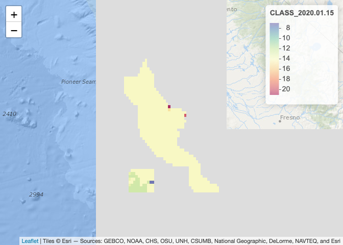
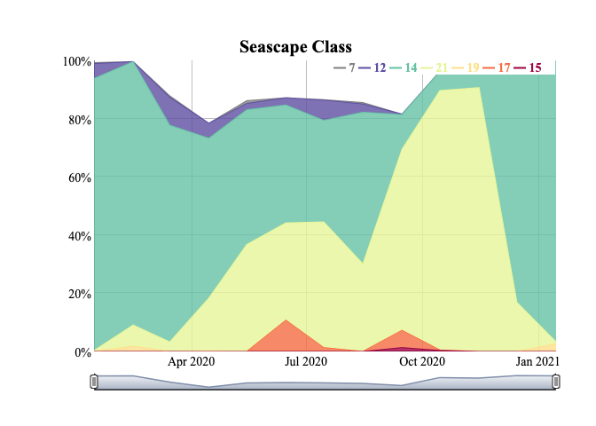

<!-- README.md is generated from README.Rmd. Please edit that file -->

<!-- DELETE data_ss/ before running -->

# seascapeR <a href='https://marinebon.org/seascapeR'></a>

[](https://github.com/marinebon/seascapeR/actions?query=workflow%3Apkgdown)

<!--
[](https://github.com/mitchelloharawild/icon/actions?workflow=R-CMD-check)
[](https://codecov.io/gh/mitchelloharawild/icon?branch=master)
[](https://www.tidyverse.org/lifecycle/#experimental)
[](https://cran.r-project.org/package=icon)
-->

<!-- [](https://cran.r-project.org/package=icon) -->

The `seascapeR` package provides functions for fetching, analyzing and
visualizing
[Seascapes](https://coastwatch.noaa.gov/cw/satellite-data-products/multi-parameter-models/seascape-pelagic-habitat-classification.html),
a global and regional dynamic sea water classification product derived
from satellite imagery by [Maria Kavanaugh
(OSU)](https://ceoas.oregonstate.edu/people/maria-kavanaugh).

In particular, this package is meant to help nodes in the
[MarineBON.org](https://marinebon.org) network extract Seascape data,
especially across [NOAA Sanctuaries](https://sanctuaries.noaa.gov), for
comparison with biological data from eDNA, sound, telemetry and other
observational data to evaluate how dynamic water masses relate to
ecosystem function.

## Install

``` r
remotes::install_github("marinebon/seascapeR")
```

## Use

Load the library and map Seascape classes using a web map server (wms)
that loads image tiles (not data) interactively (zoom, pan) from R.

``` r
library(seascapeR)

# variables
sanctuary   = "mbnms"          # or see: ?get_url_ply
ss_dataset  = "global_monthly" # or "global_8day"
ss_var      = "CLASS"          # or "P"
date_beg    = "2020-01-01"
date_end    = "2021-01-01"

# paths
dir_data = here::here("data_ss")
dir_ply  = glue::glue("{dir_data}/ply")
dir_grd  = glue::glue(
  "{dir_data}/{sanctuary}_{ss_dataset}_{date_beg}_to_{date_end}")
ts_csv   = glue::glue(
  "{dir_data}/{sanctuary}_{ss_dataset}_{date_beg}_to_{date_end}_{ss_var}.csv")

# get sanctuary polygon
ply <- get_url_ply(
  sanctuary = sanctuary, 
  dir_ply   = dir_ply)
ply
#> Geometry set for 1 feature 
#> geometry type:  MULTIPOLYGON
#> dimension:      XY
#> bbox:           xmin: -123.1401 ymin: 35.5 xmax: -121.1036 ymax: 37.88163
#> geographic CRS: WGS 84
#> MULTIPOLYGON (((-122.5 35.5, -123 35.5, -123 35...

# get SeaScape dataset information
ss_info <- get_ss_info(dataset = ss_dataset)
ss_info
#> <ERDDAP info> noaa_aoml_4729_9ee6_ab54 
#>  Base URL: https://cwcgom.aoml.noaa.gov/erddap/ 
#>  Dataset Type: griddap 
#>  Dimensions (range):  
#>      time: (2003-01-15T12:00:00Z, 2020-11-15T12:00:00Z) 
#>      latitude: (-89.975, 89.975) 
#>      longitude: (-179.975, 179.975) 
#>  Variables:  
#>      CLASS: 
#>          Units: None 
#>      P: 
#>          Units: Punits

# map SeaScape using web map server (wms) image tiles
map_ss_wms(ss_info, ply, ss_var = ss_var)
```

<!-- -->

``` r

# get SeaScape grids within polyon for date range 
grds <- get_ss_grds(
  ss_info, ply, 
  ss_var    = ss_var, 
  date_beg  = date_beg, 
  date_end  = date_end,
  dir_tif   = dir_grd)
#> Warning in get_ss_grds(ss_info, ply, ss_var = ss_var, date_beg = date_beg, : The
#> date_end 2021-01-01 > Seascapes end (2020-11-15) so decreasing to 2020-11-15.

# get first grid, a raster layer in the raster stack grds
grd <- raster::raster(grds, 1)

# map SeaScape grid
map_ss_grd(grd)
```

<!-- -->

``` r

# summarize SeaScape grids into a time series table
tbl <- sum_ss_grds_to_ts(grds, ts_csv = ts_csv)
tbl
#> Registered S3 method overwritten by 'cli':
#>   method     from    
#>   print.boxx spatstat
#> # A tibble: 54 x 4
#>    date       cellvalue n_cells pct_cells
#>    <date>         <int>   <int>     <dbl>
#>  1 2020-01-15         7       2   0.00337
#>  2 2020-01-15        12      31   0.0522 
#>  3 2020-01-15        14     558   0.939  
#>  4 2020-01-15        21       2   0.00337
#>  5 2020-01-15        NA       1   0.00168
#>  6 2020-02-15        14     543   0.914  
#>  7 2020-02-15        19      12   0.0202 
#>  8 2020-02-15        21      39   0.0657 
#>  9 2020-02-15        NA       0   0      
#> 10 2020-03-15         7       3   0.00505
#> # … with 44 more rows

# plot SeaScape time series
plot_ss_ts(tbl, show_legend = "always")
```

<!-- -->

### Interactivity

Note that when you run the code above in any of these R environments,
you get an interactive visualization:

1.  [RStudio](https://rstudio.com/products/rstudio/download/) Console;
2.  knitted html from an [Rmarkdown](https://rmarkdown.rstudio.com/)
    document; or
3.  a [Shiny](https://shiny.rstudio.com/) app.

The interactive map allows you to zoom and pan. The time series has
sliders to change the time window and hover over to get values.

For more on how to use the `seascapeR` functions and view these
interactive visualizations, see the [Getting
Started](articles/seascapeR.html) article.

### Data files

Data files were cached by setting path variables and feeding as
arguments to functions in the following order:

1.  `get_url_ply()`: Based on `dir_ply`, save \*.zip, unzip and
    shapefile with file components \*.shp, etc, readable by any GIS
    program.
2.  `get_ss_grds()`: Based on `dir_grd`, save grids (aka rasters) as
    GeoTIFs (\*.tif) with filenames of form
    “grd\_\[ss\_var\]\_\[date\].tif”, readable by any GIS program.
3.  `plot_ss_ts()`: Based on `ts_csv`, save the table as a
    comma-seperated value (\*.csv) file, readable by any spreadsheet
    program.

<!-- end list -->

``` r
fs::dir_tree(dir_data)
#> /Users/bbest/github/seascapeR/data_ss
#> ├── mbnms_global_monthly_2020-01-01_to_2021-01-01
#> │   ├── grd_CLASS_2020.01.15.tif
#> │   ├── grd_CLASS_2020.02.15.tif
#> │   ├── grd_CLASS_2020.03.15.tif
#> │   ├── grd_CLASS_2020.04.15.tif
#> │   ├── grd_CLASS_2020.05.15.tif
#> │   ├── grd_CLASS_2020.06.15.tif
#> │   ├── grd_CLASS_2020.07.15.tif
#> │   ├── grd_CLASS_2020.08.15.tif
#> │   ├── grd_CLASS_2020.09.15.tif
#> │   ├── grd_CLASS_2020.10.15.tif
#> │   └── grd_CLASS_2020.11.15.tif
#> ├── mbnms_global_monthly_2020-01-01_to_2021-01-01_CLASS.csv
#> ├── mbnms_global_monthly_2020-01-01_to_2021-01-01_CLASS_attr.csv
#> └── ply
#>     ├── mbnms_py2
#>     │   ├── mbnms_py.dbf
#>     │   ├── mbnms_py.html
#>     │   ├── mbnms_py.kml
#>     │   ├── mbnms_py.prj
#>     │   ├── mbnms_py.sbn
#>     │   ├── mbnms_py.sbx
#>     │   ├── mbnms_py.shp
#>     │   ├── mbnms_py.shp.htm
#>     │   └── mbnms_py.shx
#>     └── mbnms_py2.zip
```

## Contribute

For more on how to contribute to `seascapeR` package development, see
[CONTRIBUTE.md](https://github.com/marinebon/seascapeR/blob/main/CONTRIBUTE.md).
